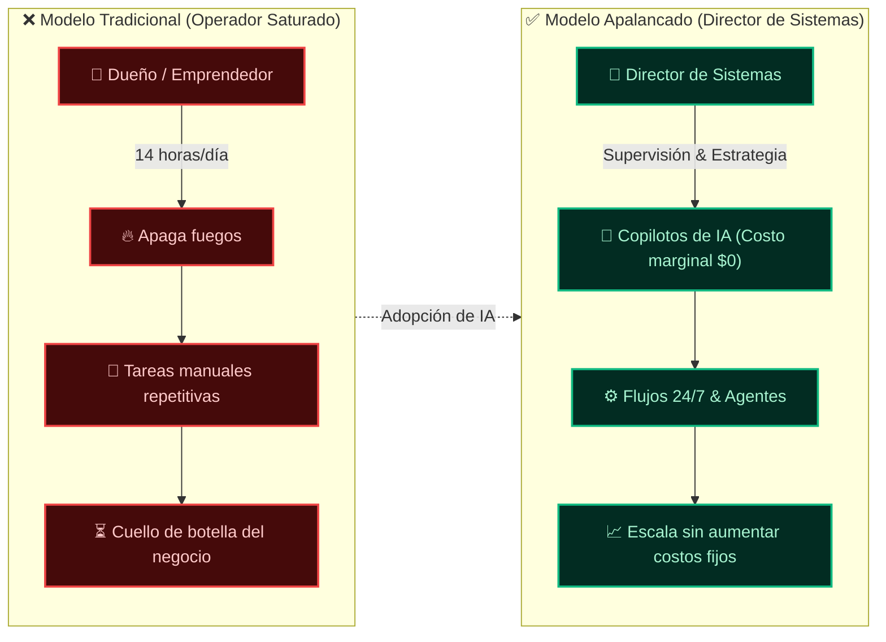
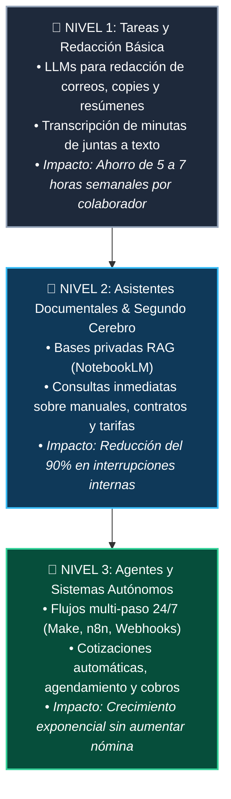
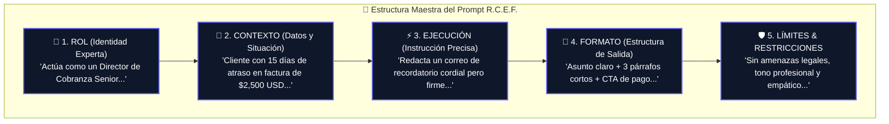
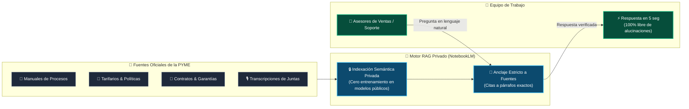
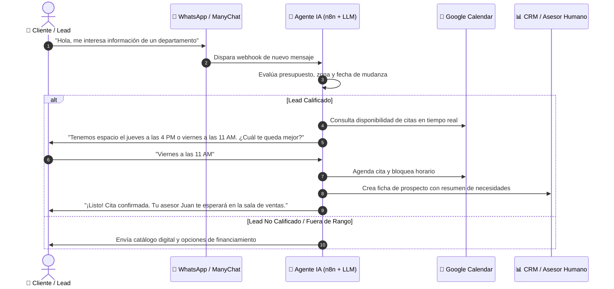
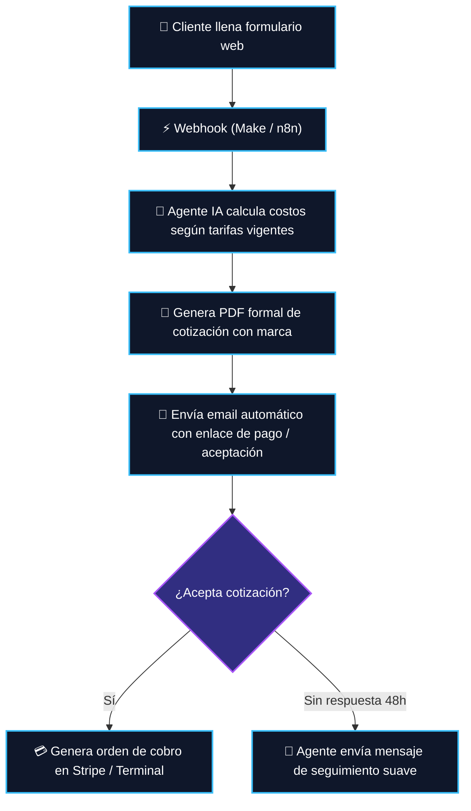
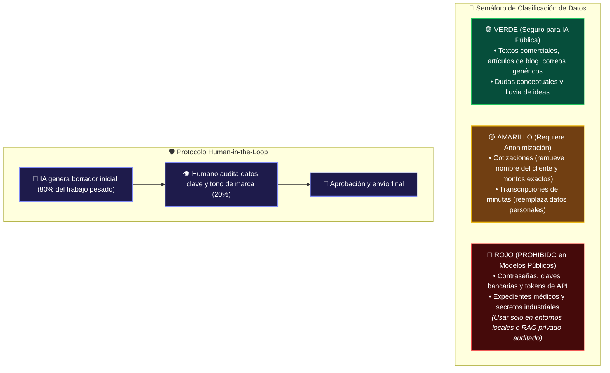

# 📐 Diagramas de Arquitectura y Flujo (Skill Archify)
## Libro: *"Usa la IA y Trabaja Menos"*
*Colección completa de esquemas visuales para documentación, diapositivas y material gráfico del e-Book.*

---

### 1. Figura 0.1: Transformación del Empresario (De Esclavo Operativo a Director de Sistemas)

---

### 2. Figura 1.1: La Pirámide del Apalancamiento Cognitivo en la PYME

---

### 3. Figura 2.1: Anatomía del Prompt Perfecto (Framework R.C.E.F.)

---

### 4. Figura 3.1: Arquitectura del Segundo Cerebro Empresarial (NotebookLM / RAG)

---

### 5. Figura 4.1: Flujo de Ventas Automatizado en WhatsApp (Caso Inmobiliario / Comercial)

---

### 6. Figura 5.1: Flujo de Cotización Autónomo en 3 Minutos

---

### 7. Figura 6.1: El Semáforo de Privacidad & Protocolo Human-in-the-Loop

---

### 8. Figura 7.1: Hoja de Ruta de Transformación en 14 Días

```mermaid
gantt
    title Cronograma de Implementación Táctico en 14 Días
    dateFormat  D
    axisFormat  Día %d

    section Fase 1: Cimientos
    Día 1: Auditoría de Tiempo y Retorno Cognitivo :a1, 1, 1d
    Día 2: Selección de los 3 Dolores Operativos    :a2, after a1, 1d
    Día 3: Configurar Semáforo de Seguridad         :a3, after a2, 1d
    Día 4: Biblioteca de Prompts R.C.E.F.           :a4, after a3, 1d

    section Fase 2: Segundo Cerebro
    Día 5: Recopilar Manuales y Políticas           :b1, after a4, 1d
    Día 6: Cargar Base RAG en NotebookLM            :b2, after b1, 1d
    Día 7: Pruebas de Estrés y Validación           :b3, after b2, 1d

    section Fase 3: Agentes & ROI
    Días 8-10: Construcción de Flujo No-Code + HITL :c1, after b3, 3d
    Días 11-14: Lanzamiento Piloto y Medición de ROI:c2, after c1, 4d
```

