# 🚀 Estrategia de Lanzamiento en LinkedIn y Arquitectura de Hosting
## Proyecto: *"Usa la IA y Trabaja Menos"* & *"PYMES Autónomas"* • GCC OpenClaw

---

## 🌐 PARTE 1: Estrategia de Hosting y Despliegue Global

Para que los usuarios puedan leer el e-book interactivo, escuchar los audios en segundo plano y descargar los PDFs sin fricción ni caídas de servidor, la arquitectura recomendada es **Serverless Edge (Frontend) + Storage CDN (Media) + Supabase (Leads)**.

```mermaid
flowchart TD
    User["📱 Usuario en LinkedIn / Web"] --> Domain["🌐 Tu Dominio (ej. ebook.tuempresa.com)"]
    Domain --> Vercel["⚡ Vercel / Cloudflare Pages (Frontend Rápido)"]
    Vercel --> Landing["📄 landing.html (Opt-in Lead Gate)"]
    Landing -->|Email + Teléfono| Supa[("🗄️ Supabase Cloud (ebook_leads)")]
    Landing -->|Redirección Inmediata| Ebook["📖 ebook_interactivo.html (Libro 1)"]
    Ebook -->|Aprobar Quiz 80%| Ebook2["🚀 pymes_autonomas_interactivo.html (Libro 2)"]
    
    subgraph "Media & Streaming CDN"
        Audio["🎙️ Masterclasses M4A (24 min)"]
        Video["🎬 Video Cápsulas HD"]
        PDFs["📚 PDFs Descargables"]
    end
    
    Ebook --> Audio
    Ebook --> Video
    Ebook --> PDFs
```



---

### 🛠️ Opciones de Hosting Recomendadas

#### 🥇 Opción 1: Despliegue en Vercel (Recomendada • 5 minutos)
1. **Crear repositorio en GitHub:**
   * Sube los archivos de la carpeta `OpenClaw_eBook` a un repositorio de GitHub (privado o público).
2. **Conectar en Vercel:**
   * Entra a [vercel.com](https://vercel.com) e inicia sesión con tu GitHub.
   * Haz clic en **"Add New Project"** y selecciona el repositorio.
   * En *Framework Preset* selecciona **"Other"** (HTML estático).
   * Haz clic en **Deploy**.
3. **Resultado:**
   * Tendrás una URL instantánea con certificado SSL gratis (ej. `openclaw-ebook.vercel.app`) y CDN global ultrarrápida.
   * Puedes vincular tu propio dominio personalizado en `Project Settings > Domains`.

---

#### 🥈 Opción 2: Cloudflare Pages + R2 Storage (Ideal para Alto Tráfico de Audio)
* **Cloudflare Pages:** Aloja el HTML/CSS/JS de forma ilimitada y gratuita.
* **Cloudflare R2:** Almacena los audios pesados (45 MB) y videos (20 MB) con **$0 costo de transferencia (Zero Egress Fees)**, garantizando que el streaming en móviles no tenga buffering.

---

### 🔒 Flujo de Conversión de Leads (Opt-In Gate)
1. **Punto de Entrada:** El usuario llega a `landing.html` (o `index.html`).
2. **Captura:** Ingresa Nombre, Correo y WhatsApp.
3. **Registro:** Los datos se guardan en tu base de datos **Supabase Cloud** (`ebook_leads`) y/o en el archivo local `leads.db`.
4. **Desbloqueo Instantáneo:** Se le redirige inmediatamente a `ebook_interactivo.html` y se le envía una copia por correo/WhatsApp vía Make o n8n.
5. **Panel de Control:** Puedes monitorear los leads en tiempo real y exportarlos a CSV desde `admin.html`.

---

## 📈 PARTE 2: Estrategia de Crecimiento y Promoción en LinkedIn

LinkedIn es el canal B2B por excelencia para vender este concepto a dueños de negocio, CEOs y directores operativos.

### 🎯 Los 3 Ángulos Psicológicos Ganadores
1. **El Ataque al Mito del "Emprendedor Esclavo":** Romper la idea tóxica de que trabajar 14 horas al día es necesario para que una empresa funcione.
2. **La Brecha de los 44 Puntos:** El 68% de las empresas usan IA como un buscador cosmético; solo el 17.7% la integra como un sistema operativo autónomo.
3. **El Formato Fricción-Cero (Libro Interactivo + Audio Masterclass):** Vender la conveniencia: *"¿No tienes tiempo de leer? Escucha la Masterclass de 24 min en el auto"*.

---

### 🗓️ Secuencia de 4 Posts Listos para Publicar (Plantillas Copy-Paste)

---

#### 📌 Post 1: La Historia Personal / Punto de Quiebre (Storytelling de Autoridad)
**Objetivo:** Conectar emocionalmente con el dolor del dueño de PYME y generar empatía.

```text
A las 2:14 AM de un martes cualquiera, sobre mi escritorio había 3 tazas de café frío, hojas de cálculo descuadradas y 40 mensajes de clientes sin responder.

Sentí esa opresión en el pecho que todo dueño de negocio conoce:
La sensación de ser el cuello de botella de tu propia empresa.

Esa noche entendí una verdad incómoda:
Trabajar 14 horas al día no es una medalla de honor; es un síntoma de falla estructural.

La mayoría de las PYMES no quiebran por falta de ventas, sino por el agotamiento operativo de sus fundadores.

Durante los últimos meses documenté el sistema exacto para pasar de "Operador Manual Apaga-Fuegos" a "Director de Sistemas Apalancado con IA", sin saber programar y sin gastar miles de dólares.

El resultado es nuestra nueva obra interactiva:
📘 "Usa la IA y Trabaja Menos" + 🚀 "PYMES Autónomas"

Incluye:
✅ Calculadora interactiva de Retorno de Tiempo (ROI)
✅ Banco de Prompts con el Framework R.C.E.F.
✅ Protocolo del Semáforo de Privacidad
✅ 4 Masterclasses en Audio HD para escuchar en el auto
✅ Quiz de Acreditación interactivo

🎁 Lo he liberado completamente GRATIS para la comunidad.

Si quieres el acceso directo a la plataforma interactiva:
👉 Comenta "SISTEMA" abajo y te envío el enlace por mensaje privado.

#InteligenciaArtificial #Productividad #Emprendimiento #PYMES #Liderazgo
```

---

#### 📌 Post 2: El Mito de la Nómina vs. Apalancamiento Agéntico (Polémico / Datos)
**Objetivo:** Generar debate técnico y posicionarte como referente de sistemas.

```text
Contratar más personal NO va a solucionar el desorden de tu empresa.

Si tus procesos actuales son caóticos, duplicar el equipo solo te dará "caos a escala".

Hicimos un análisis en más de 50 pequeñas y medianas empresas y encontramos un patrón alarmante:

🚨 El 68% usa IA de forma cosmética (para redactar un correo o resumir un texto).
🚨 Solo el 17.7% la tiene integrada en sus procesos operativos reales.

Eso deja una brecha de 44 PUNTOS entre quienes usan la IA como juguete y quienes están construyendo empresas autónomas.

En el nuevo e-Book interactivo "Usa la IA y Trabaja Menos" demostramos cómo un equipo de 5 personas puede recuperar más de 7.2 horas a la semana por colaborador implementando:

1. El Segundo Cerebro Documental (RAG con NotebookLM).
2. Contratos de datos JSON Schema entre agentes.
3. El Semáforo de Seguridad para no arriesgar datos privados.

🎧 Además, incluye la Masterclass en Audio: "Escala tu Empresa con Enjambres Agénticos" (24 min).

¿Quieres acceder a la versión web interactiva + audios?
Deja un comentario con la palabra "APALANCAMIENTO" y te lo mando hoy mismo.

#IAparaNegocios #Automatizacion #Productividad #Sistemas #Empresas
```

---

#### 📌 Post 3: Carrusel Visual / Infografía (Alto Guardado y Repost)
**Formato:** Sube un PDF Carrusel en LinkedIn utilizando las 3 infografías maestras ([Pirámide del Apalancamiento](file:///Users/javierrodriguez/Documents/Antigravity/OpenClaw_eBook/piramide_apalancamiento_cognitivo.png), [Semáforo de Seguridad](file:///Users/javierrodriguez/Documents/Antigravity/OpenClaw_eBook/semaforo_seguridad_ia.png) y [Arquitectura de la PYME Autónoma](file:///Users/javierrodriguez/Documents/Antigravity/OpenClaw_eBook/arquitectura_pyme_autonoma.png)).

```text
¿En qué nivel de madurez con Inteligencia Artificial está tu empresa? [Desliza ➡️]

La mayoría de los directores se quedan en el Nivel 1 (usar ChatGPT para redactar). 
Pero la verdadera rentabilidad ocurre en los Niveles 2 y 3.

En este carrusel te resumo:
📌 Diapositiva 1: La Pirámide del Apalancamiento Cognitivo
📌 Diapositiva 2: El Semáforo de Privacidad (Qué subir y qué jamás compartir)
📌 Diapositiva 3: Arquitectura de la PYME Autónoma y Enjambres ReAct
📌 Diapositiva 4: Hoja de ruta de implementación en 14 días

💡 Todo este material forma parte de la plataforma interactiva "Usa la IA y Trabaja Menos" de GCC OpenClaw.

Comenta "CARRUSEL" y te comparto el link con las infografías en alta resolución para descargar + la calculadora de ROI.

#Infografia #Tecnologia #TransformacionDigital #GestionEmpresarial
```

---

#### 📌 Post 4: El Reto / Desafío del Quiz (Gamificación Viral)
**Objetivo:** Activar la curiosidad intelectual de los directivos para que hagan el Quiz y desbloqueen el Libro 2.

```text
Solo el 12% de los profesionales de negocios logran un puntaje perfecto en este test de IA operativa. 🧠

Diseñamos un Quiz Interactivo de 5 preguntas sobre:
- Framework R.C.E.F.
- RAG y Bases Privadas sin Alucinaciones
- Gobernanza de Datos y Privacidad
- Diferencia técnica entre un Chatbot y un Agente Autónomo

🏆 Si obtienes más del 80%, la plataforma te genera tu Certificado Oficial de Nivel 1 y te desbloquea el acceso al Libro 2: "PYMES Autónomas (Nivel Enterprise)".

¿Te animas a poner a prueba el nivel de tu empresa?

Comenta "QUIZ" y te paso el link directo al simulador.

#Quiz #Certificacion #Innovacion #InteligenciaArtificial
```

---

## ⚙️ PARTE 3: Automatización de Entrega de Leads (Fórmula de Conversión)

Para convertir los comentarios de LinkedIn en leads calificados sin pasar horas respondiendo a mano:

1. **Estrategia "Comenta para recibir":**
   * El algoritmo de LinkedIn premia los posts con muchos comentarios en las primeras 2 horas multiplicando su alcance orgánico x5.
2. **Respuesta Manual o con Herramienta (ej. Expandi / Lempod / PhantomBuster / Make):**
   * Mensaje al DM:
     > *"¡Hola [Nombre]! Aquí tienes el acceso directo a la plataforma interactiva y las masterclasses en audio: [TU_URL_DE_LANDING]. ¡Espero te sirva un montón y me cuentas qué puntaje sacas en el Quiz!"*
3. **Seguimiento a los 3 Días:**
   * Preguntarles si pudieron calcular su ahorro en la calculadora de ROI o si tienen dudas implementando su primer agente.
